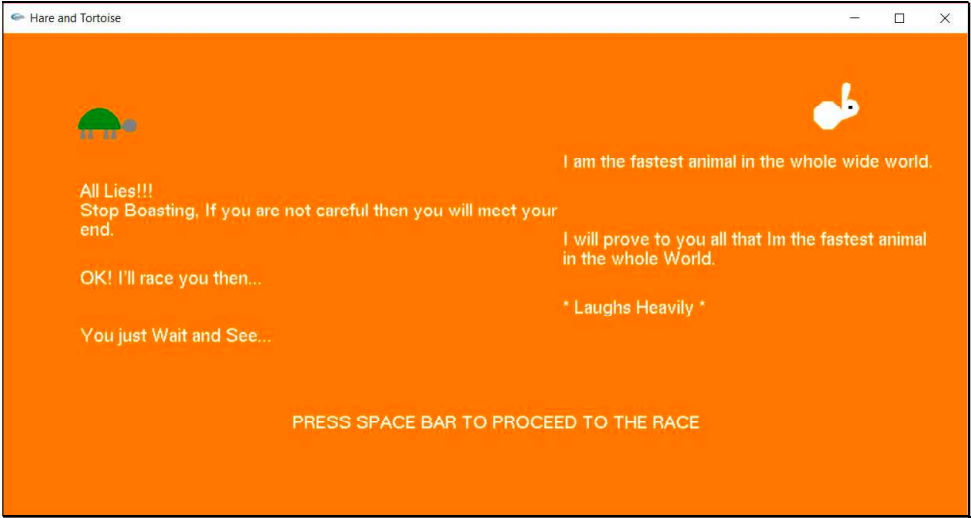

# Hare-And-Tortoise-Computer-Graphics
In this Project, we display the short story of hare and tortoise graphically. The animation of the Hare and the Tortoise Race story is developed using OpenGL Library in C++.

REQUIREMENTS: OPENGL LIBRARY (Refer [Install OpenGL](http://www.cse.iitm.ac.in/~vplab/courses/CG/OpenGL-Install-Guide.pdf))

## Screenshots:

